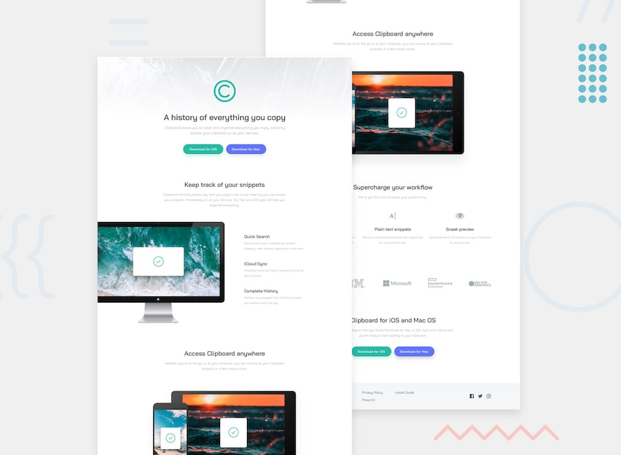

# Clipboard landing page



# Clipboard Landing Page

Welcome to the Clipboard Landing Page project! This repository contains the source code for a responsive and modern landing page designed for Clipboard, a fictional tool that makes copying and sharing text seamless.

## Project Overview

The Clipboard Landing Page is a visually appealing and user-friendly webpage that showcases the features and benefits of the Clipboard tool. It is designed to provide visitors with a quick understanding of the product, encouraging them to explore further or sign up.

## Features

- **Responsive Design:** The landing page is fully responsive, ensuring optimal viewing and interaction across various devices and screen sizes.
- **Modern Aesthetics:** Clean and modern design with smooth animations to enhance user experience.
- **Informative Sections:** Includes sections for product features, user testimonials, and a call-to-action.
- **Accessibility:** Ensures accessibility by adhering to best practices, such as using appropriate HTML tags and ARIA attributes.

## Technologies Used

- HTML5
- CSS3
- JavaScript
- Bootstrap

## Getting Started

To get started with the project, follow these steps:

1. **Clone the repository:**

    ```bash
    git clone https://github.com/Codex-I/clipboard-landing-page.git
    ```

2. **Navigate to the project directory:**

    ```bash
    cd clipboard-landing-page
    ```

3. **Open the `index.html` file in your web browser to view the landing page:**

    ```bash
    open index.html
    ```

## Usage

- **Explore the Features:** Scroll through the landing page to learn about the Clipboard tool's features and benefits.
- **Responsive Design:** Resize your browser or view the page on different devices to see the responsive design in action.
- **Interactive Elements:** Interact with buttons and links to experience the smooth animations and transitions.

## Contributing

We welcome contributions to improve the Clipboard Landing Page. To contribute, follow these steps:

1. **Fork the repository.**
2. **Create a new branch for your feature or bug fix:**

    ```bash
    git checkout -b feature-name
    ```

3. **Make your changes and commit them:**

    ```bash
    git commit -m "Description of your changes"
    ```

4. **Push your changes to your forked repository:**

    ```bash
    git push origin feature-name
    ```

5. **Create a pull request to the main repository.**

Please ensure your code follows our coding standards and includes appropriate documentation.

## License

This project is licensed under the MIT License. See the [LICENSE](LICENSE) file for more details.

## Contact

If you have any questions, suggestions, or feedback, feel free to reach out to us at [contact@clipboard.com](mailto:contact@clipboard.com).

---

Happy coding!

- The Cartoon Developers
